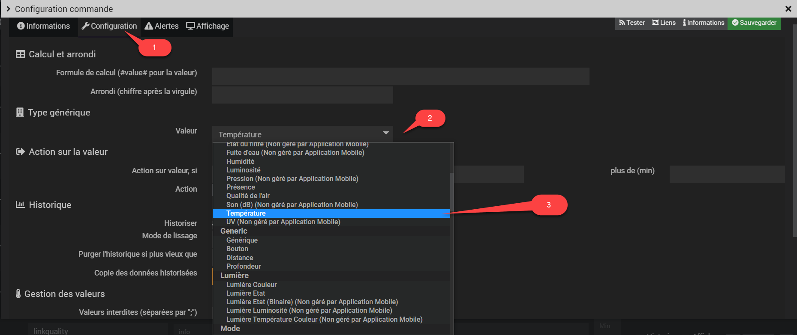

# L'application est sur les stores.

L'application est disponible sur les stores en BETA (IOS ou Android).  
Il faudra donc avoir le plugin BETA et suivre le [Fil community](https://community.jeedom.com/t/jeemate-version-0-9-0-android-ios-et-le-debut-de-la-personnalisation/60221?u=titi_titi)
Ou sur le discord de DomoTech [Fil community](https://discord.gg/zvGTDfE)

Cordialement
Thibaut Et Pascal

Plugin officiel de l'application JeeMate sur Android.
Et dans le Futur sur Android TV et IOS

Ce plugin permet d'appairer JeeMate avec votre serveur Jeedom, très facilement en seulement quelques clics. afin de créer un équipement virtuel qui vous permettra, via l'application, d'envoyer et recevoir des notifications,  et déclencher des événements basés sur la géolocalisation de votre appareil.

Sommaire
==============================

 - [Présentation de l'application](#paragraphe1)
 - [Fonctionnalités](#paragraphe2)
 - [Compatibilité avec Jeedom](#paragraphe3)
 - [Compatibilité avec les plugins Jeedom](#paragraphe4)
 - [Tableau des compatibilités](#paragraphe5)
	 - [Chauffage](#paragraphe5-1)
	 - [Généric](#paragraphe5-2)

Compatibilité avec Jeedom 
==============================

JeeMate gère les types génériques définis dans JEEDOM et plus!
Pour qu'un équipement apparaisse dans JeeMate, l'équipement doit être visible et avec des types génériques configurés sur ses commandes.

[Plus d'informations sur les types génériques.](https://www.jeedom.com/blog/3327-application-mobile-les-types-generiques/)

Ce mode de fonctionnement permet automatiquement de retourver ses équipements dans JeeMate. 
Le prérequis est bien évidement que les types génériques soient correctement configururés.

Tableau des compatibilités 
==============================

[List des génériques type supportés](index.md#paragraphe5)

Pourquoi l'usage des types génériques 
==============================

Les types génériques ont été introduit dans Jeedom pour permettre à certaines applications tierces d'identifier l'équipement Jeedom et d'en connaitre ses propriétés afin de pourvoir l'utiliser.
Pour exemple, l'application officielle Jeedom SAS, les plugins des assistants vocaux, et des plugins tiers comme HomeBridge, utilisent les types génériques.
La configuration d'un équipement permettra d'être reconnu dans les applications tiers le supportant.

Les génériques types founit en standard par Jeedom SAS restent limités et certains plugin ajoute leurs propres types génériques pour une meilleur intégration. C'est le cas de Jeemate par le biais de son plugin.
L'avantage est de profiter de l'intégration de type d'équipement pas encore pris en compte par la team officielle Jeedom.
L'inconvénient c'est que les génériques types proriétaires à un plugin ne sont exploitatble que par ce dernier. 
Il faut garder espoir que dans un futur proche les génériques type Jeedom évolue pour permettre une plus large couverture et standard des équipements supportés.

Le plugin Jeemate 
==============================

La configuration via le plugin Jeemate permet de positionner sur vos équipements les types génériques standard de Jeedom mais aussi ceux introduits pour les équipements non prévu à ce jour par Jeedom.

La configuration des types génériques via le core Jeedom sont bienévidement pris en compte, mais ne vous permettra pas de disposer des génériques types propriétaire à JeeMate.

#### Configuration via le core Jeedom 

Sur la commande de votre équipement, cliquer sur {:height="50%" width="50%"} afin d'ouvrir la page de configuration de la commande en question :

Configuration des types génériques sur vos équipements 
==============================

Après téléchargement du plugin, vous devez commencer par l'activer.

