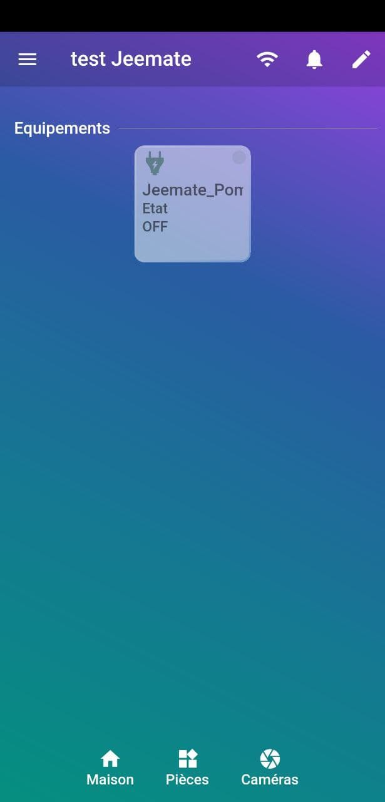

# Les types génériques

Sommaire
==============================

- [Compatibilité avec Jeedom](#paragraphe1)
- [Tableau des compatibilités](#paragraphe2)
- [Pourquoi l'usage des types génériques](#paragraphe3)
- [La configuration des types génériques](#paragraphe4)
  - [via le core Jeedom](#paragraphe4-1)
  - [via le plugin JeeMate](#paragraphe4-2)
- [Exemples de configurations](#paragraphe5)
  - [Prise](#paragraphe5-1)
  - [Lumière](#paragraphe5-2)
    - [Lumière ON/OFF](#paragraphe5-2-1)
    - [Lumière dimable](#paragraphe5-2-2)
    - [Lumière Philips Hue](#paragraphe5-2-2)
    - [Serrure](#paragraphe5-3)
    - [Thermostat](#paragraphe5-3)
    - [Mode](#paragraphe5-3)
    - [Volet](#paragraphe5-3)
    - [Caméra](#paragraphe5-3)
    - [Chauffage](#paragraphe5-3)
    - [Température/Humidité](#paragraphe5-3)

Compatibilité avec Jeedom 
==============================

JeeMate gère les types génériques définis dans JEEDOM et plus!
Pour qu'un équipement apparaisse dans JeeMate, l'équipement doit être visible et avec des types génériques configurés sur ses commandes.

[Plus d'informations sur les types génériques.](https://www.jeedom.com/blog/3327-application-mobile-les-types-generiques/)

Ce mode de fonctionnement permet automatiquement de retourver ses équipements dans JeeMate. 
Le prérequis est bien évidement que les types génériques soient correctement configururés.

Tableau des compatibilités 
==============================

[List des génériques type supportés](index.md#paragraphe5)

Pourquoi l'usage des types génériques 
==============================

Les types génériques ont été introduit dans Jeedom pour permettre à certaines applications tierces d'identifier l'équipement Jeedom et d'en connaitre ses propriétés afin de pourvoir l'utiliser.
Pour exemple, l'application officielle Jeedom SAS, les plugins des assistants vocaux, et des plugins tiers comme HomeBridge, utilisent les types génériques.
La configuration d'un équipement permettra d'être reconnu dans les applications tiers le supportant.

Les génériques types founit en standard par Jeedom SAS restent limités et certains plugin ajoute leurs propres types génériques pour une meilleur intégration. C'est le cas de Jeemate par le biais de son plugin.
L'avantage est de profiter de l'intégration de type d'équipement pas encore pris en compte par la team officielle Jeedom.
L'inconvénient c'est que les génériques types proriétaires à un plugin ne sont exploitatble que par ce dernier. 
Il faut garder espoir que dans un futur proche les génériques type Jeedom évolue pour permettre une plus large couverture et standard des équipements supportés.

La configuration des types génériques 
==============================

La configuration via le plugin Jeemate permet de positionner sur vos équipements les types génériques standard de Jeedom mais aussi ceux introduits pour les équipements non prévu à ce jour par Jeedom.

La configuration des types génériques via le core Jeedom sont bienévidement pris en compte, mais ne vous permettra pas de disposer des génériques types propriétaire à JeeMate.

### Configuration via le core Jeedom 

Sur la commande de votre équipement, cliquer sur  afin d'ouvrir la page de configuration de la commande en question :

### Configuration via le plugin JeeMate 

Dans le plugin Jeemate, cliquer sur configuration avancée :

(1) Cliquer sur l'onglet équipement 
(2) possibilité de filtrer 
(3) cliquer sur l'engrenage pour accéder à la configuration des génériques type de l'équipement 

Sur la ou les commmandes spécifier le type générique

Exemples de configuration 
==============================

### **Prise** 

Types génériques pour les équipements "prise" :

| Equipement | Type générique | Obligatoire | Spec |
| ----------- | -------- | -------- | -------- |
| Prise	|Info/Prise Etat	|OUI	| 0 = Eteint  1 = Allumé
| Prise	|Action/Prise  Bouton On|	OUI	|Réf. vers Info/Prise Etat
| Prise	|Action/Prise Bouton Off|	OUI	|Réf. vers Info/Prise Etat

La configuration des commandes prise :

La même configuration sous HomeBridge  :

Apercu dans l'application:
| ON | OFF | Custo |
| ----------- | -------- | -------- |
| 	|	|	|

Possibilité de modification du visuel 
=> lien vers la documentation

___
### Lumière 

___
#### Lumière ON/OFF 

___
#### Lumière dimable 

___
#### Lumière Philips Hue 

___
### Serrure 

___
### Thermostat 

___
### Mode 

___
### Volet 

___
### Caméra 

___
### Chauffage 

___
### Température/Humidité 

